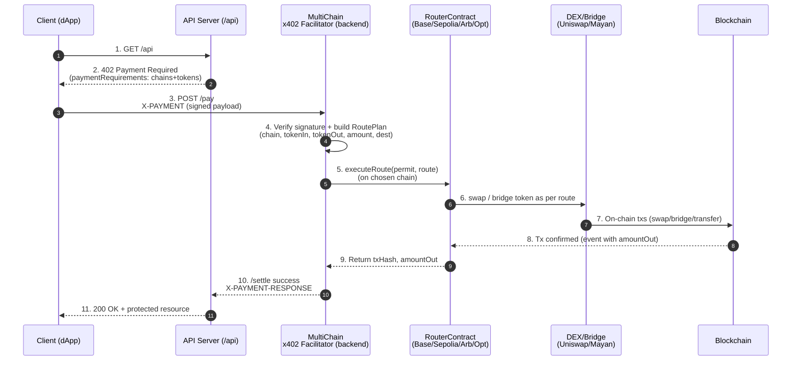

## **Overview**

## **Architecture Diagram (Mermaid)**


---

## **Smart Contract Requirements**

### **PaymentRouter.sol**

Deploy the same contract on:

* Base
* Sepolia
* Arbitrum
* Optimism

#### **Responsibilities**

* Accept permit signature + routing params
* Pull tokens from user via `permit`
* Optionally swap tokens using DEX router
* Transfer to merchant payout address
* Emit event for backend confirmation

### **Data Structures**

```solidity
struct PermitData {
    address token;
    address owner;
    uint256 nonce;
    uint256 deadline;
    bytes sig;
}

struct RouteParams {
    bytes32 paymentId;
    address tokenIn;
    address tokenOut;
    uint256 amountIn;
    uint256 minAmountOut;
    address merchant;
    address dexRouter;
    bytes dexCalldata;
}
```

---

### **executeRoute() Skeleton**

```solidity
function executeRoute(PermitData calldata permit, RouteParams calldata route) external onlyRelayer {
    // 1. Validate payment and routing info
    // 2. Pull funds from payer using permit
    // 3. If needed call Uniswap router using `dexCalldata`
    // 4. Transfer to merchant or trigger bridge contract call
    // 5. emit RouteExecuted(...)
}
```

---

## **Backend Facilitator**

### **Endpoints**

| Endpoint  | Purpose                                        |
| --------- | ---------------------------------------------- |
| `/verify` | Decode payload, verify signature, build route  |
| `/settle` | Execute router contract call and return txHash |

### **Flow**

#### **/verify**

* Decode `X-PAYMENT`
* Verify signature with wallet signature typed data
* Validate supported chain & token
* Build `RoutePlan`
* Save `PaymentRecord` in memory DB
* Return `{ isValid: true }`

#### **/settle**

* Fetch `PaymentRecord`
* Call router `executeRoute()`
* Wait for confirmation
* Return `X-PAYMENT-RESPONSE`

---

## **Backend Types**

```ts
type ChainConfig = {
  chainId: number;
  rpcUrl: string;
  routerAddress: string;
  supportedTokens: TokenConfig[];
};
```

---

## **Protected API**

### `/api/secret`

| Type                          | Response             |
| ----------------------------- | -------------------- |
| GET (no payment)              | 402 Payment Required |
| GET with `X-PAYMENT-RESPONSE` | 200 OK               |

---

## **Frontend UI Requirements**

* Chain dropdown
* Token dropdown
* “Execute Payment”
* Logs:

  * PaymentID
  * Chosen chain & token
  * TX hash
  * Status timeline

---

## **15-Hour Build Schedule**

| Time   | Task                                       |
| ------ | ------------------------------------------ |
| 0–1h   | Setup repo, clone x402 example, role split |
| 1–3h   | Contract: implement PaymentRouter          |
| 3–4h   | Deploy to Base testnet                     |
| 4–6h   | Backend: `/verify` + `/settle`             |
| 6–8h   | `/api/secret` integration                  |
| 8–10h  | Frontend UI                                |
| 10–11h | Multi-chain config                         |
| 11–13h | Token swapping options                     |
| 13–15h | Final polish + testing + pitch             |

---

## **Task Split**

| Role              | Responsibilities               |
| ----------------- | ------------------------------ |
| Contract engineer | PaymentRouter.sol + deployment |
| Backend engineer  | verify/settle + routing        |
| Frontend          | UI integration                 |
| API / DevOps      | end-to-end testing & cleanup   |

---

## **Pitch One-Liner**

> **We built a multi-chain x402 router that enables pay-any-chain, pay-any-token settlement with real-time access unlock for paid API resources.**

---
